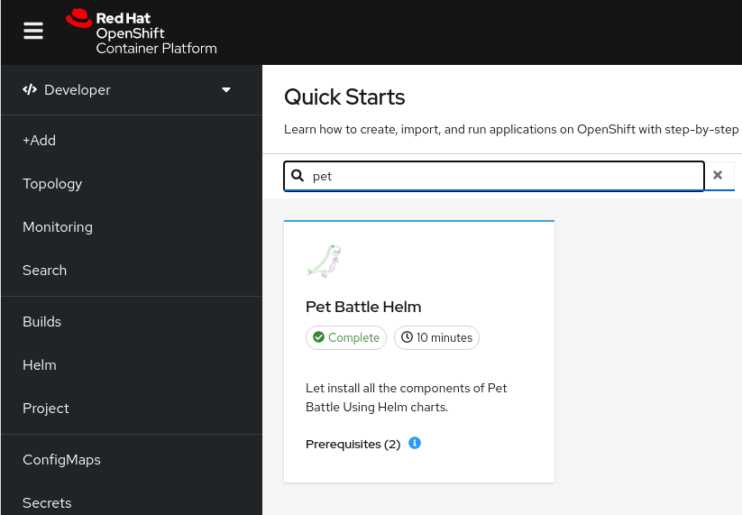

## Pet Battle Quick Start for OpenShift

As a cluster-admin load the getting started into your cluster
```bash
oc apply -f pet-battle-helm.yaml
```

The quick start is now available under the *? -> Quick Start* menu:



For best experience when running the quick start, pre-install the **Web Terminal** Operator from RedHat at cluster scope.

## Demo

